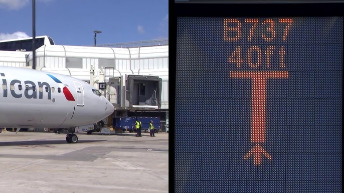
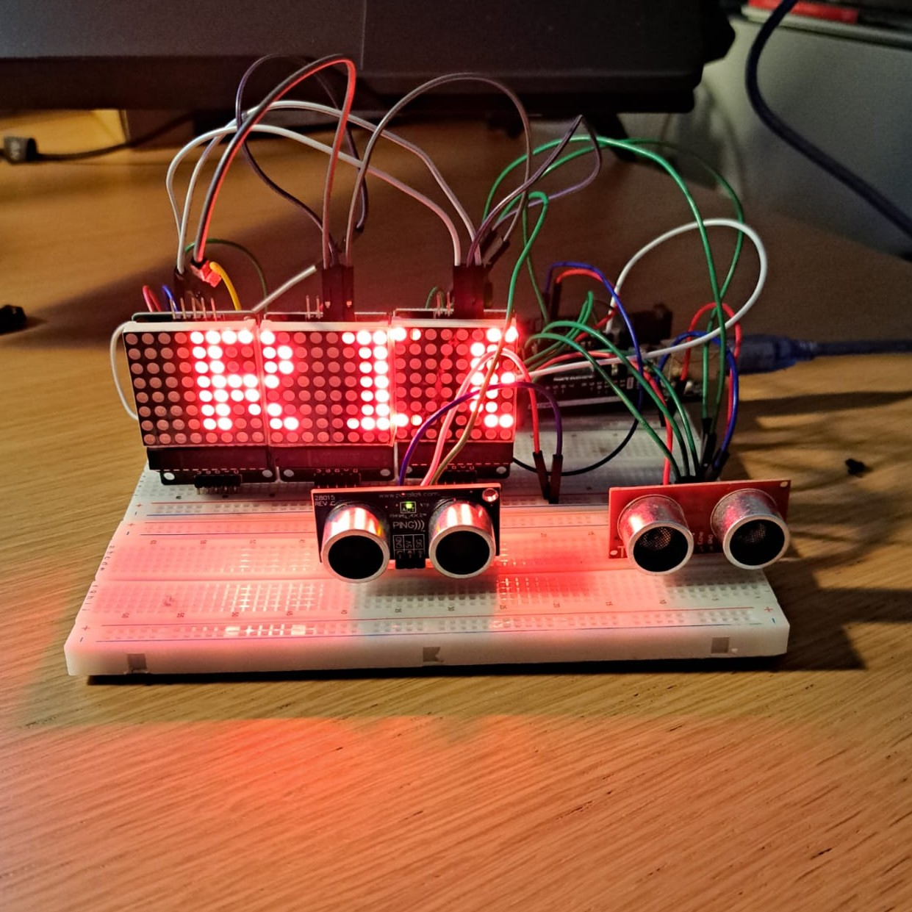
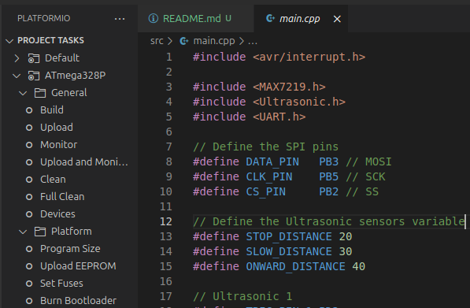

# Small Scale Visual Docking Guidance System (VDGS)
Small scale implementation of a **Visual Docking Guidance System (VDGS)** in AVR programming. This project showcases the implemementation of **SPI** communication between the Arduino Uno and the components.

<p align="center">
    
    
</p>

### MAX7219: LED Matrix
The LED matrices are driven by the `MAX7219` drivers and utilises the `SPI` communication protocol. This project implements a custom driver interface with the cascaded matrices. Please refer to the [datasheet](https://www.analog.com/media/en/technical-documentation/data-sheets/max7219-max7221.pdf) and the [custom driver](lib/MAX7219/MAX7219.h) file. For this project, the LED matrices are used to display positional information to guide incoming objects for (conceptually) precise docking.

## Getting Started
This project utilises the [PlatformIO](https://platformio.org/) build framework and VSCode as its IDE. As pre-requisite, please install [VSCode]() and the [PlatformIO IDE extension](https://marketplace.visualstudio.com/items?itemName=platformio.platformio-ide).

Clone the project
```shell
git clone https://github.com/Arief-AK/AVR_SPI_Communication.git
```
 Build and upload using the PlatformIO framework



Depending on the position of the object infront of the two ultrasonic sensors, an appropriate message will be displayed scrolling accross the cascaded matrices.